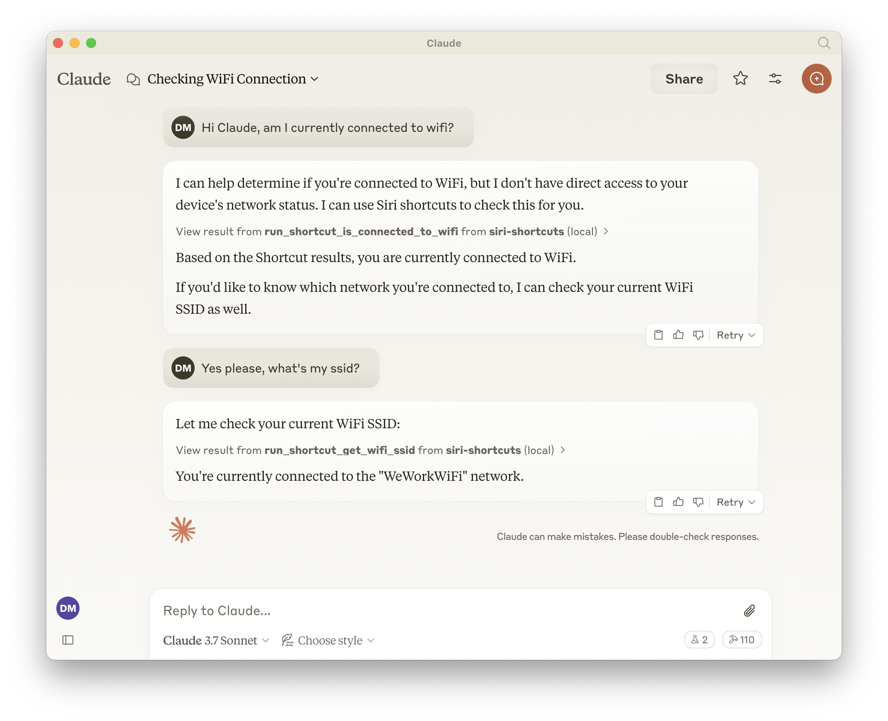

[](https://mseep.ai/app/dvcrn-mcp-server-siri-shortcuts)

# Siri Shortcuts MCP Server

This MCP server provides access to Siri shortcuts functionality via the Model Context Protocol (MCP). It allows listing, opening, and running shortcuts from the macOS Shortcuts app.



## Features

- Exposes _all_ shortcuts, meaning the LLM can call anything that is available in the Shortcuts app.
- List all available shortcuts
- Open shortcuts in the Shortcuts app
- Run shortcuts with optional input parameters
- Dynamically generated tools for each available shortcut

## Tools

### Base Tools

1. `list_shortcuts`

   - Lists all available Siri shortcuts on the system
   - No input required
   - Returns: Array of shortcut names

   ```json
   {
     "shortcuts": [{ "name": "My Shortcut 1" }, { "name": "My Shortcut 2" }]
   }
   ```

2. `open_shortcut`

   - Opens a shortcut in the Shortcuts app
   - Input:
     - `name` (string): Name of the shortcut to open

3. `run_shortcut`
   - Runs a shortcut with optional input
   - Input:
     - `name` (string): Name of the shortcut to run
     - `input` (string, optional): Text input or filepath to pass to the shortcut

### Dynamic Tools

The server automatically generates additional tools for each available shortcut in the format:

- Tool name: `run_shortcut_[sanitized_shortcut_name]`
- Description: Runs the specific shortcut
- Input:
  - `input` (string, optional): Text input or filepath to pass to the shortcut

## Usage with Claude

Add to your Claude configuration:

```json
{
  "mcpServers": {
    "siri-shortcuts": {
      "command": "npx",
      "args": ["mcp-server-siri-shortcuts"]
    }
  }
}
```

## Implementation Details

- Uses the macOS `shortcuts` CLI command under the hood
- Sanitizes shortcut names for tool naming compatibility
- Supports both direct text input and file-based input
- Returns shortcut output when available
- Implements standard MCP error handling
